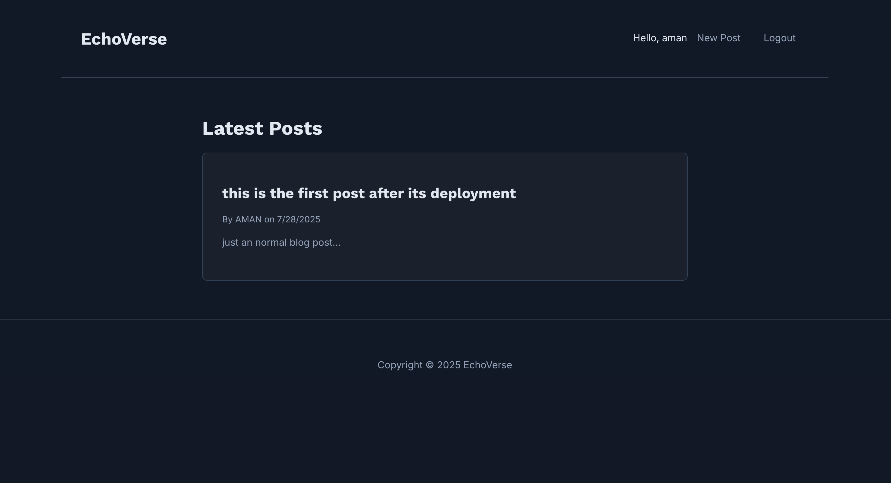

# EchoVerse: A Full-Stack MERN Content Management System

**Live Demo:** [https://blog-frontend-xi-coral.vercel.app/] -->

---

## About The Project

EchoVerse is a dynamic, full-stack content management system built from the ground up using the MERN stack. As my first major portfolio project, it demonstrates a comprehensive understanding of modern web development, from backend API design and database management to frontend state handling and user interface design.

The application provides a secure and intuitive platform for users to register, create, and manage their own blog posts, showcasing a complete CRUD (Create, Read, Update, Delete) workflow with robust user authentication.

### Key Features:

* **Secure User Authentication:** Implemented using JSON Web Tokens (JWT) for secure session management, with password hashing via `bcrypt.js` to protect user data.
* **Full CRUD Functionality:** Users have complete control over their content, with the ability to create, view, edit, and delete their own posts.
* **RESTful API:** A well-structured backend API built with Node.js and Express, handling all data logic and serving content to the frontend.
* **Modern Frontend:** A responsive and visually appealing single-page application (SPA) built with React, featuring a minimalist dark-mode theme, custom fonts, and a focus on user experience.
* **Cloud Deployment:** The application is fully deployed and live, with the backend hosted on Render and the frontend on Vercel, demonstrating a complete CI/CD pipeline.

### Tech Stack:

* **Frontend:** React, React Router, Axios
* **Backend:** Node.js, Express.js
* **Database:** MongoDB (with Mongoose)
* **Authentication:** JSON Web Tokens (JWT), bcrypt.js
* **Deployment:** Vercel (Frontend), Render (Backend)

---

## A Key Learning Experience: Solving a Deep-Rooted CORS Issue

During development, I encountered a persistent CORS (Cross-Origin Resource Sharing) error that blocked communication between the frontend and backend, even with a standard `cors()` middleware implementation.

My debugging process was systematic:
1.  I first implemented a more explicit CORS configuration, specifying allowed origins.
2.  When that failed, I used console logs to confirm the server was correctly restarting with the new code.
3.  Finally, after proving the code was correct, I diagnosed the issue as an environmental problem on my local machine—a port conflict with macOS's AirPlay service on port 5000.

By moving the backend server to a new port (`5001`) and updating all frontend API endpoints, I successfully resolved the issue. This experience taught me a valuable lesson in debugging problems that extend beyond the code itself and into the deployment and network environment.
